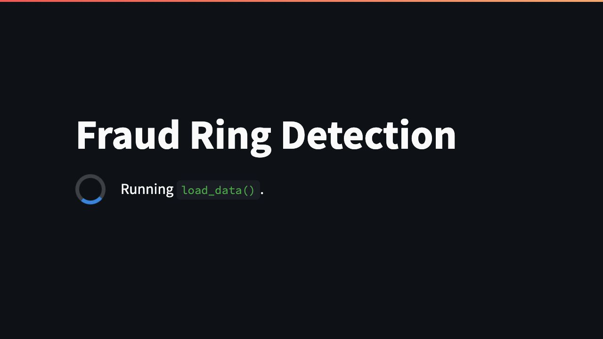
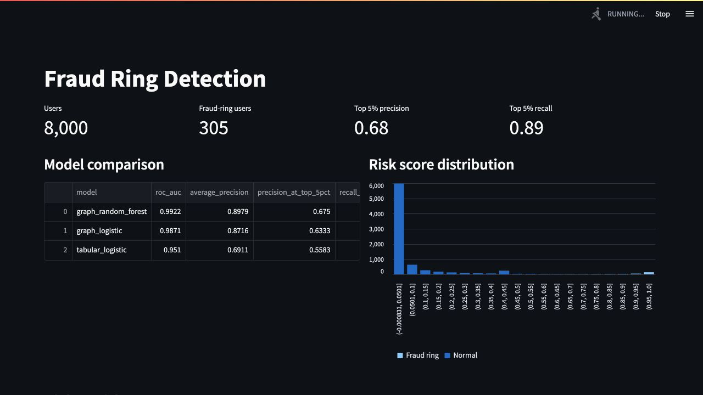

# Fraud Ring Detection With Graph ML

An end-to-end fraud analytics project that shows why relationship data can surface coordinated abuse that transaction-level features miss.

The project simulates a payments ecosystem with users, merchants, devices, IP addresses, cards, and hidden fraud rings. The synthetic fraud includes account farms, mule merchants, shared-device rings, and promo abuse, plus benign shared behavior such as families, offices, coworking spaces, and student houses sharing IPs or occasional devices.

It then trains a baseline tabular model and compares it with graph-enhanced models that use shared infrastructure signals such as common devices, IPs, cards, mule merchants, connected component size, and Node2Vec-style user embeddings. The final output is a Streamlit investigation dashboard for ranking high-risk users and inspecting suspicious shared-infrastructure components.





## Business Problem

Fraud teams often review suspicious users one account at a time, using signals like transaction amount, merchant count, online share, and night-time activity. That approach can miss organized rings because each individual account may look only mildly unusual.

The business objective here is to prioritize analyst review for coordinated fraud-ring activity:

- identify users likely to belong to fraud rings
- rank the highest-risk accounts for investigation
- expose the shared infrastructure connecting suspicious users
- improve recall in a fixed review queue, such as the top 5% of users by risk

In a real payments, marketplace, or fintech setting, this kind of model helps reduce losses and analyst workload by moving the review question from "Is this user unusual?" to "Is this user part of a coordinated network?"

## Modelling Approach

The target is user-level fraud-ring membership. The pipeline creates synthetic data, builds user-level features, trains multiple classifiers, writes model artifacts, and renders a suspicious network component for investigation.

### Baseline Tabular Features

The baseline model uses only individual transaction aggregates:

- transaction count
- mean, standard deviation, maximum, and log mean amount
- online transaction rate
- night transaction rate
- merchant and category diversity
- transactions per merchant

This represents the kind of model a fraud team could build from a flat transactions table without network intelligence.

### Graph-Enhanced Features

The graph models add relationship features generated from shared identifiers and merchant overlap:

- maximum and mean users sharing a device
- maximum and mean users sharing an IP address
- maximum and mean users sharing a card
- maximum and mean users connected through merchants
- mule merchant rate and count
- shared-identifier connected component size
- combined shared device/IP/card pressure
- graph risk score from component size, shared identifiers, and merchant concentration

The final model is selected from logistic regression and random forest candidates, then saved to `models/fraud_ring_model.joblib`.

### Node2Vec Embeddings

The pipeline also builds a projected user-user graph from shared:

- devices
- IP addresses
- cards
- merchants

It then creates Node2Vec-style embeddings using biased random walks over that graph. To keep the project easy to run in Colab, the implementation does not require a separate compiled graph package: it generates random walks, builds a sparse skip-gram co-occurrence matrix, and compresses that matrix into `n2v_*` embedding columns with truncated SVD.

Training now compares:

- `tabular_logistic`: tabular transaction aggregates only
- `graph_logistic` and `graph_random_forest`: tabular plus handcrafted graph features
- `node2vec_logistic`: tabular plus Node2Vec embeddings
- `node2vec_random_forest`: tabular plus handcrafted graph features plus Node2Vec embeddings

## Results

Current run: 8,000 users, 30,000 transactions, 305 injected fraud-ring users, and 30 benign shared-infrastructure groups.

| Model | ROC AUC | Average Precision | Precision at Top 5% | Recall at Top 5% |
| --- | ---: | ---: | ---: | ---: |
| node2vec_random_forest | 0.99249 | 0.90940 | 0.541 | 0.879 |
| graph_random_forest | 0.99221 | 0.89792 | 0.675 | 0.890 |
| graph_logistic | 0.98711 | 0.87159 | 0.633 | 0.835 |
| node2vec_logistic | 0.97842 | 0.80857 | 0.592 | 0.780 |
| tabular_logistic | 0.95103 | 0.69113 | 0.558 | 0.736 |

The best embedding-enhanced model improves average precision from 0.691 to 0.909, showing stronger ranking quality across the review queue. The strongest fixed-capacity review queue is still the handcrafted graph random forest, which lifts top-5% recall from 0.736 to 0.890.

The graph random forest also improves precision at top 5%, from 0.558 to 0.675. In practice, that means the analyst queue contains both more ring members and fewer unrelated users at the same review depth. The Node2Vec random forest is the best overall ranker by average precision, while the handcrafted graph model is currently the best strict top-5% triage model.

## Why Graph ML Beats Tabular Features

Tabular features describe what a user did in isolation. Graph features describe who and what the user is connected to.

Fraud rings are designed to make individual accounts look plausible: each user may transact at normal amounts, visit a reasonable number of merchants, and avoid extreme behavior. The stronger signal is often relational:

- many users touching the same device or IP
- multiple accounts cycling through the same card infrastructure
- users clustering around mule merchants
- large connected components that should be rare for normal customers
- repeated overlap across identifiers that is unlikely to happen by chance

That is why the graph model improves recall. It can flag an account because it belongs to a suspicious component, even when the account's own transaction summary is not extreme.

The synthetic data also includes innocent shared infrastructure, so shared identifiers alone are not enough. The model has to separate concentrated, multi-signal abuse from noisier real-world patterns like families and offices sharing IPs.

## Dashboard

The Streamlit app gives an analyst-style view of the model output:

- portfolio-level counts and review metrics
- model comparison table
- risk score distribution
- highest-risk users with an adjustable score threshold
- suspicious shared-infrastructure component visualization
- user-level feature inspection for a selected account

Run it with:

```bash
python3 -m streamlit run app.py
```

## Quick Start

Create the synthetic dataset, train the models, and launch the dashboard:

```bash
python3 generate_data.py
python3 train_model.py
python3 -m streamlit run app.py
```

For a larger run:

```bash
python3 generate_data.py --users 20000 --transactions 150000 --rings 50
python3 train_model.py
```

## Project Structure

```text
.
├── app.py
├── generate_data.py
├── train_model.py
├── src/fraud_ring_detection/
│   ├── data.py
│   ├── features.py
│   ├── models.py
│   └── visualization.py
├── data/
│   ├── raw/
│   └── processed/
├── models/
└── reports/
    ├── metrics.csv
    ├── suspicious_ring.svg
    ├── top_suspicious_users.csv
    └── screenshots/
```

## Outputs

Training writes the main artifacts used by the app and README:

- `data/processed/user_features.csv`
- `data/processed/user_scores.csv`
- `data/processed/transactions_enriched.csv`
- `data/raw/benign_shared_infrastructure.csv`
- `models/fraud_ring_model.joblib`
- `reports/metrics.csv`
- `reports/top_suspicious_users.csv`
- `reports/suspicious_ring.svg`
- `reports/screenshots/streamlit-dashboard-overview.jpg`
- `reports/screenshots/streamlit-suspicious-component.jpg`

## Next Upgrades

- Add temporal graph features such as shared infrastructure within rolling windows.
- Convert the graph to PyTorch Geometric for GraphSAGE node classification.
- Add threshold tuning based on analyst capacity and investigation cost.
- Add SHAP or permutation importance to explain top review candidates.
